# 파이썬 장고 프레임워크를 활용한 API서버 만들기
## 개발 환경 설정하기 for Mac

### Python 버전 확인

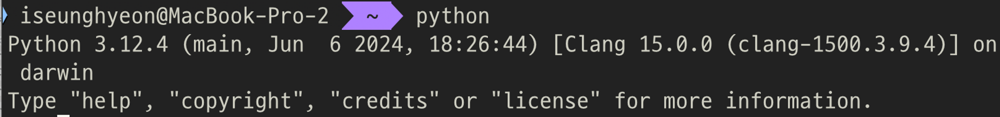](README_images/image.png)

### Python 가상 환경 설정하기

- Python 설치가 완료되었다면 다음 단계는 Python의  **venv**라는 모듈을 사용해서 우리가 만들 Django 프로젝트의 가상 환경을 설정해주어야 합니다.
- 그렇다면 로컬서버에 프로젝트를 만들고 작업하지 않고 프로젝트마다 가상환경을 설정해주어야 하는 이유는 무엇일까요?

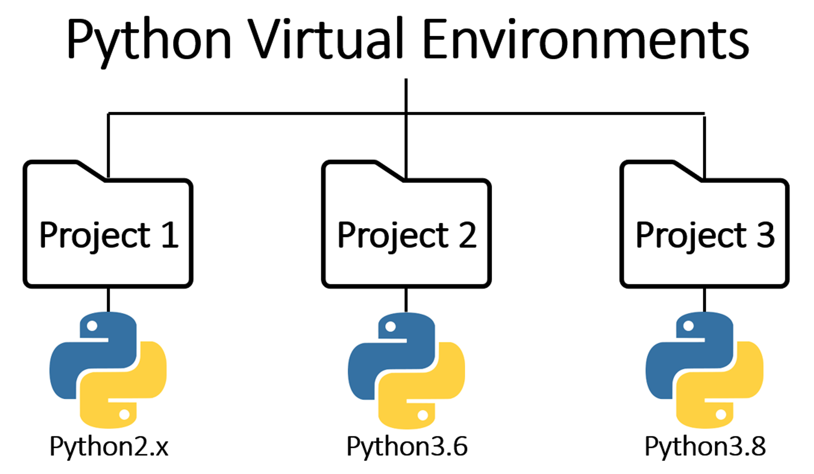

- 그 이유는 서로 다른 유형과 목적의 프로젝트들을 한 공간에 넣어서 관리한다면, 매번 하나의 프로젝트를 실행할 때마다 그에 맞춰서 환경을 체크하고 변경해주어야 하며 심한 경우에는 프로젝트 간의 충돌이 발생할 수도 있기 때문입니다. 따라서 이와 같은 문제점들을 방지하고, Python 프로젝트들을 각각의 목적에 맞게 효율적으로 관리할 수 있다는 측면에서 Python 프로젝트를 다룰 때에는 가상환경을 만들어 사용하는 방법이 권장되고 있습니다.
- Python에서 가상 환경을 생성

python -m venv project-name

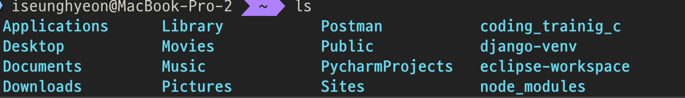
- 가상 환경 실행 및 비활성화
  - 내가 만든 가상환경의 이름 (**django-venv)**이 표시된다면 정상적으로 활성화

source django-venv/bin/activate
deactivate

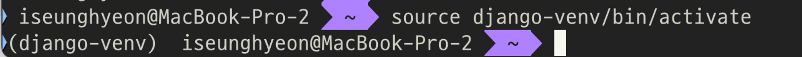

### Django 설치

- 가상 환경 설치 후 실행
- **Successfully installed**라는 문구가 담긴 결과화면이 나온다면 성공

pip install django

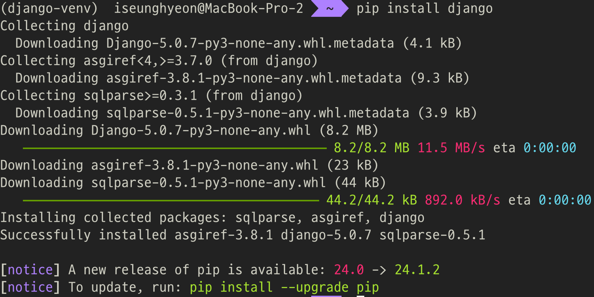

- python이 아닌 python3가 가상 환경 내에 있음

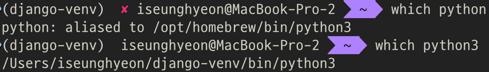

- 따라서 django의 버전 확인 명령어는 다음과 같아야 함

python3 -m django --version

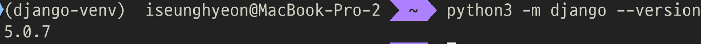

## Django Project 생성하기

> **참고**: 나는 가상 환경(django-venv)과 프로젝트(mysite)를 django-project 폴더로 옮겼다
> 
> 
> 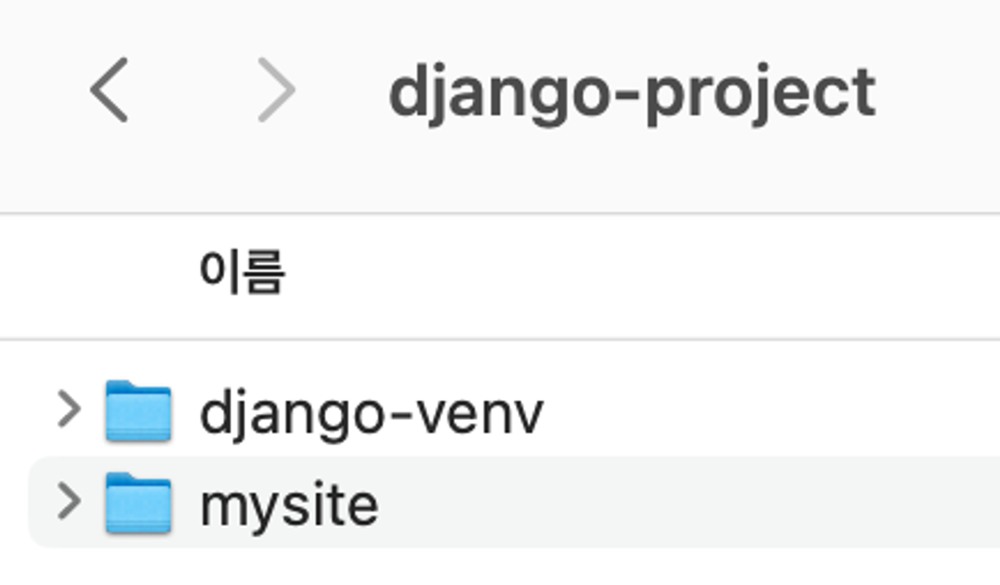

1. 가상 환경 실행하기
2. 새로운 Django 프로젝트 생성하기
  - mysite 자리에 원하는 프로젝트 이름 넣기
  
  
django-admin startproject mysite

  
3. vscode에서 프로젝트 열기
  
  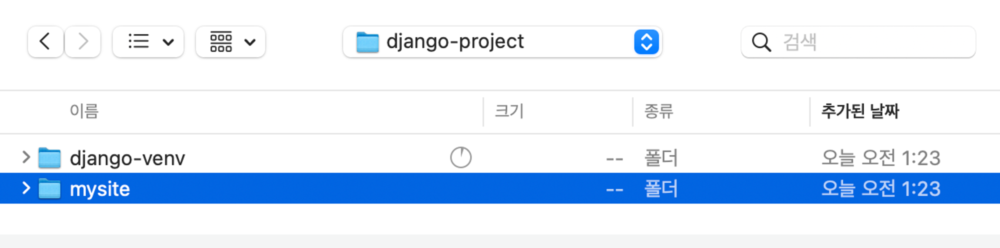
  
  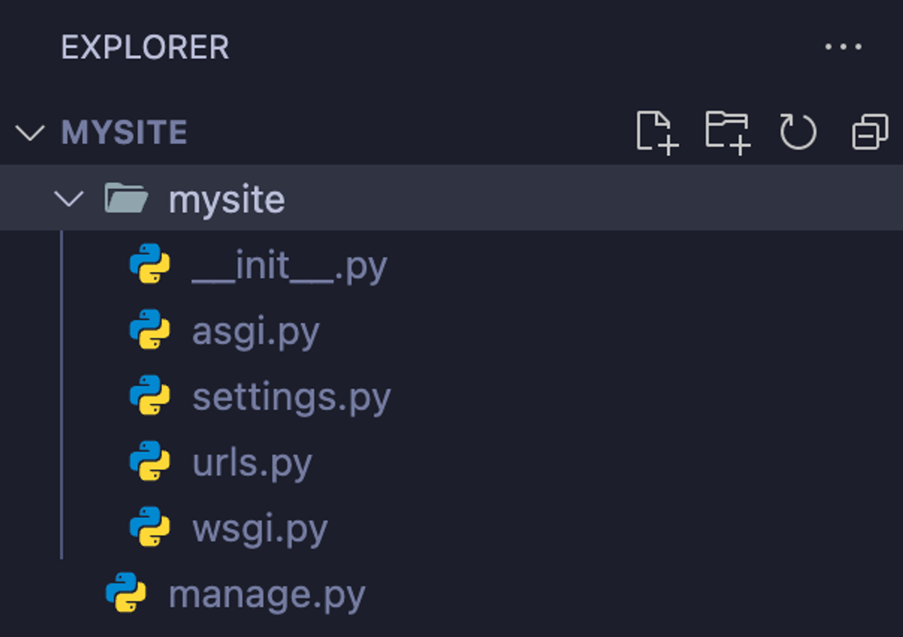
  
4. 생성한 프로젝트를 서버에서 실행하기
  
  
python3 manage.py runserver

  
  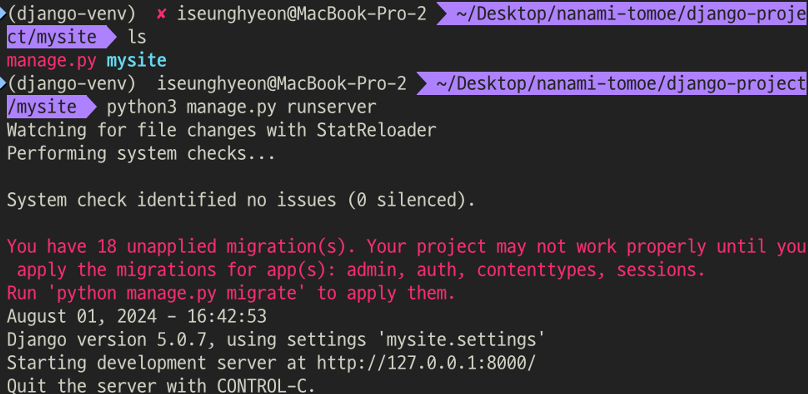
  
5. [http://127.0.0.1:8000/](http://127.0.0.1:8000/) 접속
  
  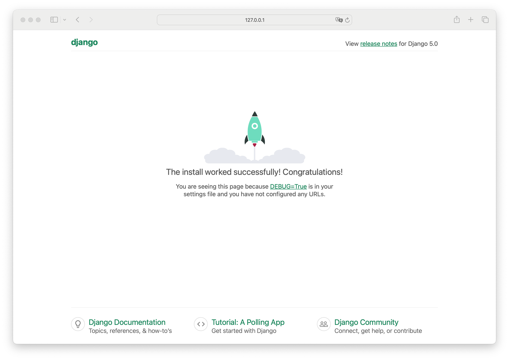
  

> **성공!**
> 

## Django App 생성하기

- polls 앱 생성하기

python3 manage.py startapp {앱이름}
python3 manage.py startapp polls

## 모델 만들기

- 모델은 데이터베이스에서 테이블(Table)에 해당하며, 각 모델은 필드(Field)를 가지고 있다.
- 모델은 DB를 테이블 별로 읽어서 하나의 테이블에 있는 값들을 코드로 읽어주는 기능을 한다.
  - 이러한 것을 ORM이라고 한다.

### 모델 만드는 순서

1. 모델 생성
2. 모델을 테이블에 써 주기 위한 마이그레이션 이라는걸 만든다.
3. 이 모델에 맞는 테이블을 만든다.

### 적용 방법

1. 사용할 APP의 [model.py](http://model.py) 수정
  
  
python
  from django.db import models
  
  # Create your models here.
  # 모델 생성
  # 모델을 테이블에 써 주기 위한 마이그레이션 이라는걸 만든다.
  # 이 모델에 맞는 테이블을 만든다.
  # 질문: 여름에 놀러간다면 어디에 갈까?
  # 산
  # 강
  # 바다
  # 도심 호캉스
  
  class Question(models.Model):
    question_text = models.CharField(max_length=200)
    pub_date = models.DateTimeField('date published')
  
  class Choice(models.Model):
    question = models.ForeignKey(Question, on_delete=models.CASCADE)
    choice_text = models.CharField(max_length=200)
    votes = models.IntegerField(default=0)

  
2. [setting.py](http://setting.py)에 INSTALLED_APPS에 앱 config 추가
  
  
python
  INSTALLED_APPS = [
    'django.contrib.admin',
    'django.contrib.auth',
    'django.contrib.contenttypes',
    'django.contrib.sessions',
    'django.contrib.messages',
    'django.contrib.staticfiles',
    'polls.apps.PollsConfig', # 이 부분!
  ]

  
3. 터미널에서 마이그레이션 파일 만들기
  
  
python3 manage.py makemigrations polls

  
  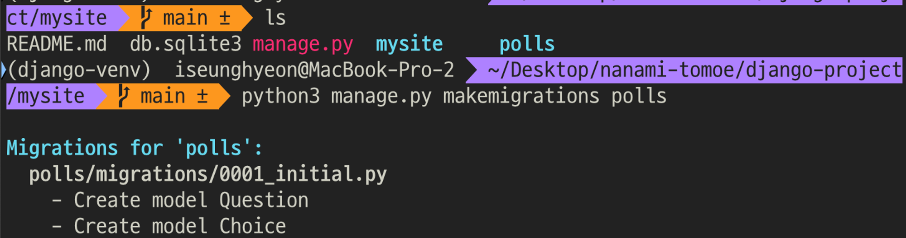
  
4. 내용 확인하기
  
  
python3 manage.py sqlmigrate polls 0001

  
  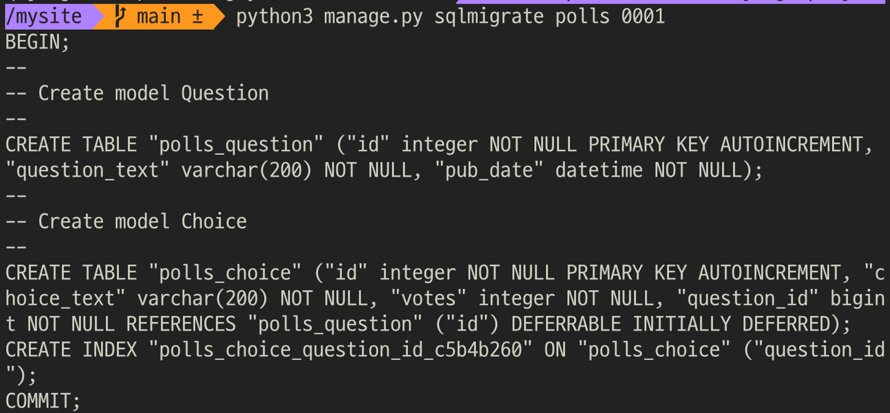
  
  id는 코드에 구현하진 않았지만 자동으로 추가됨, foreign_key에 대해 인덱싱
  
5. 테이블 만들기
  
  
python3 manage.py migrate

  
  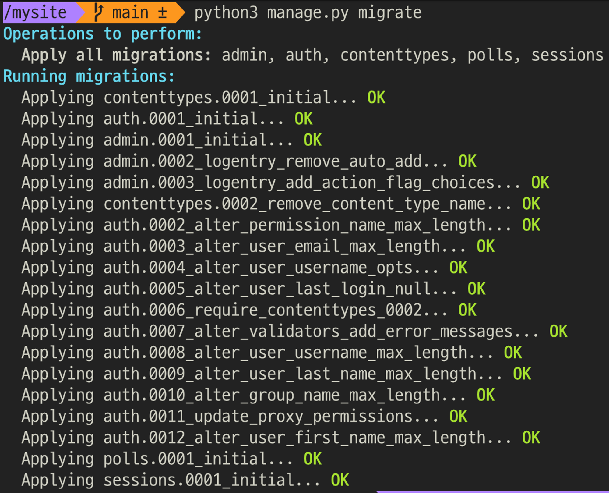
  
  polls 외에 마이그레이션된 것 들은 setting.py에 디폴트로 설정되어 있는 것들
  
  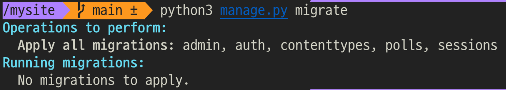
  
  한번 더 migrate하면 더이상 migration할 것 들이 없다고 뜸
  

## 장고의 다양한 모델 필드 활용하기

- 공식 문서에서 다양한 모델 필드 타입들 알아보기

[Model field reference | Django documentation](https://docs.djangoproject.com/en/5.0/ref/models/fields/)

- 많이 쓰이는 field들
  - BooleanField
  - CharField
    - string 타입
  - DateField
    - 날짜만 저장. 시간은 x
  - DateTimeField
    - 날짜와 시간 모두
  - FloatField
  - JSONField
  - TextField
    - 캐릭터보다 더 긴 텍스트들 저장